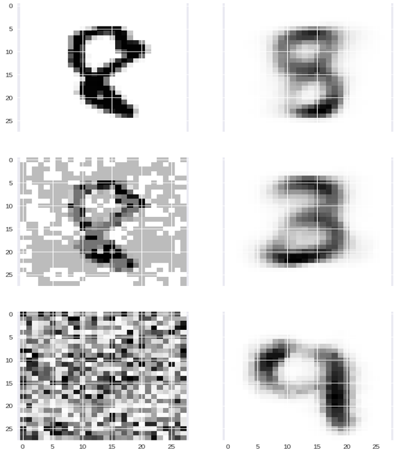
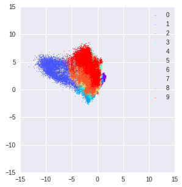
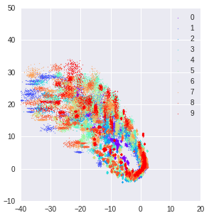
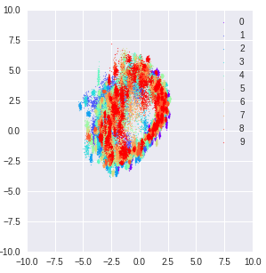
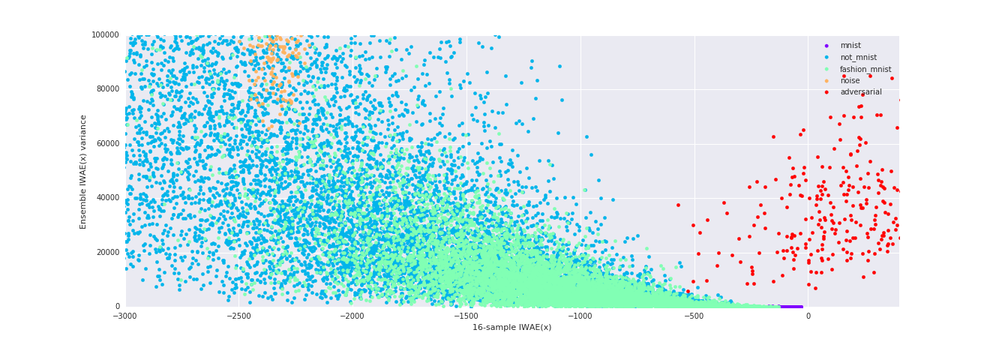

# Generative Ensembles For Robust Anomaly Detection

## How To Run/Reproduce the Results
```
python something.py --train_dataset="somedataset" --model_dir=somedir
```

something.py:

* vae_wgan/anomaly_run.py runs VAE ensemble on creditcard dataset (both training and evaluation)

* vae_wgan/vae_run.py runs VAE ensemble on mnist or fashion_mnist dataset (both training and evaluation)

* vae_wgan/wgan_run.py runs WGAN ensemble on mnist,fashion_mnist, or cifar10 dataset (both training and evaluation)


"somedataset"(training dataset based on which the models are trained and tested against other OoD datasets):

* for vae_run.py , "mnist" or "fashion_mnist"

* for wgan_run.py, "mnist", "fashion_mnist" or "cifar10"

* for anomaly_run.py,  this doesn't need to be specified as it only runs the creditcard dataset automatically


if want to skip training (having already trained models) for evaluation only, add --skip_train=True when running


What they give you:

1. VAEs (vae_run.py and anomaly_run.py)

* scores using single IWAE, ensemble mean/var of IWAEs, and WAIC (printed out as 'elbo' but actually means iwae)

* For scores using rate, change keys=['elbo'] to keys=['rate'] around line 127 under ensemble_analysis function in vae_wgan/tools/analysis.py

2. WGANs (wgan_run.py)

* scores using single logits, ensemble mean/var of logits, and WAIC(for WGANs, WAIC here means Ensemble Mean(logits) - Ensemble Var(logits) rather than the actual WAIC)

3. DNN classifier on creditcard dataset

* scores using logits (run anomaly/NNclassifer.py)


# For DL Jeju Camp

## Variational Autoencoder


Take an input from the data space, map it into a distribution (posterior) in the latent space, sample from the posterior distribution, and decode it back to an output in the data space.

Unlike in the regular VAE, we used Normalizing Flows for a richer prior.


## Out of Distribution Samples

These are reconstructed inputs for adversarially perturbed input (second row) and adversarially perturbed random noise (third row)
Both are created by the Fast Gradient Method.

?raw=true)

This is the latent space for normal digits

?raw=true)

This is the latent space for adversarially perturbed input.

?raw=true)

This is the latent space for adversarially perturbed random noise.

?raw=true)

## Anomaly Detection

As a supervised classifier we used a single NN classifier, AUROC = 0.94 and AP Score = 0.94

For a unsupervised classifier, we want to use our ensemble model.

Anomalies are also out of distribution samples. However, ELBO is not enough.

Which threshold to use for unsupervised learning?
-> Ensemble Statistics

## Ensemble Learning
The ensemble statistics will serve as proper threshold variables

?raw=true)

Using the ensemble variance of posterior means, we achieved AUROC = 0.927 and AP Score = 0.940

## Dependencies
Tensorflow Probability

## References
1.Balaji Lakshminarayanan, Alexander Pritzel, and Charles Blundell. Simple and scalable predictive uncertainty estimation using deep ensembles

2.Joshua V.Dillon, Ian Langmore, Dustin Tran, Eugene Brevdo, Srinivas Vasudevan, Dave Moore, Brian Patton, Alex Alemi, Matt Hoffman, Rif A. Saurous. Tensorflow Distributions

3.Danilo Jimenez Rezende and Shakir Mohamed, Variational Inference with Normalizing Flows

## Code Citations
url: https://github.com/tensorflow/probability/blob/master/tensorflow_probability/examples/vae.py

## Mentor
Eric Jang

## Dataset
Credit Card Fraud Detection from Kaggle

Andrea Dal Pozzolo, Olivier Caelen, Reid A. Johnson and Gianluca Bontempi. Calibrating Probability with Undersampling for Unbalanced Classification. In Symposium on Computational Intelligence and Data Mining (CIDM), IEEE, 2015

## Acknowledgements
This was supported by [Deep Learning Camp Jeju 2018](http://jeju.dlcamp.org/2018/) which was organized by [TensorFlow Korea User Group](https://facebook.com/groups/TensorFlowKR/).
